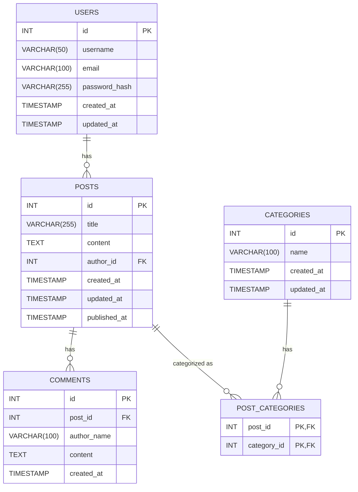

# Docker

## Dockerコマンド一覧

| コマンド | 説明 |
|----------|------|
| `docker-compose up -d` | Docker Composeで定義されたサービスをバックグラウンドで起動します。 |
| `docker-compose down` | 起動中のDocker Composeサービスを停止し、コンテナを削除します。ボリュームは削除しません。 |
| `docker-compose down -v` | 起動中のDocker Composeサービスを停止し、コンテナとボリュームを削除します。 |
| `docker-compose stop` | 起動中のDocker Composeサービスを停止しますが、コンテナは削除しません。 |
| `docker-compose start` | 停止中のDocker Composeサービスを再起動します。 |
| `docker-compose restart` | 起動中のDocker Composeサービスを再起動します。 |
| `docker-compose logs` | 全てのサービスのログを表示します。 |
| `docker-compose logs [service_name]` | 指定したサービスのログを表示します。 |
| `docker-compose ps` | 現在のDocker Composeサービスの状態を表示します。 |
| `docker exec -it [container_name] /bin/sh` | 指定したコンテナにシェルアクセスします。 |
| `docker exec -it [container_name] /bin/bash` | 指定したコンテナにBashシェルでアクセスします（Bashがインストールされている場合）。 |
| `docker volume ls` | すべてのDockerボリュームをリストします。 |
| `docker volume rm [volume_name]` | 指定したDockerボリュームを削除します。 |
| `docker network ls` | すべてのDockerネットワークをリストします。 |
| `docker network rm [network_name]` | 指定したDockerネットワークを削除します。 |
| `docker images` | すべてのDockerイメージをリストします。 |
| `docker rmi [image_id]` | 指定したDockerイメージを削除します。 |
| `docker system prune` | 使用されていないすべてのコンテナ、ネットワーク、イメージを削除します（ボリュームは削除しません）。 |
| `docker system prune -a` | 使用されていないすべてのコンテナ、ネットワーク、イメージ、およびボリュームを削除します。 |
| `docker-compose build` | Docker Composeで定義されたサービスのイメージをビルドします。 |
| `docker-compose build --no-cache` | キャッシュを使用せずにイメージを再ビルドします。 |
| `docker-compose down && docker-compose up --build -d` | Docker Composeサービスを停止し、イメージを再ビルドしてバックグラウンドで起動します。 |
| `docker-compose down && docker-compose build --no-cache && docker-compose up -d` | Docker Composeサービスを停止し、キャッシュをクリアしてイメージを再ビルドし、バックグラウンドで起動します。 |
| `docker-compose logs -f` | 全てのサービスのログをフォロー（リアルタイムで表示）します。 |
| `docker-compose up --force-recreate -d` | 既存のコンテナを強制的に再作成して、Docker Composeサービスをバックグラウンドで起動します。 |
| `docker network inspect [network_name]` | 指定したDockerネットワークの詳細情報を表示します。 |
| `docker volume inspect [volume_name]` | 指定したDockerボリュームの詳細情報を表示します。 |
| `docker-compose rm -f` | 停止されたコンテナを強制的に削除します。 |

## コマンドの使い方の例

1. **Docker Composeサービスの起動**

    ```bash
    docker-compose up -d
    ```

2. **Docker Composeサービスの停止とコンテナの削除**

    ```bash
    docker-compose down
    ```

3. **Docker Composeサービスの停止とコンテナ、ボリュームの削除**

    ```bash
    docker-compose down -v
    ```

4. **特定のサービスのログを表示**

    ```bash
    docker-compose logs app
    ```

5. **特定のコンテナにシェルアクセス**

    ```bash
    docker exec -it blog_app /bin/sh
    ```

# curlサンプル一覧（Nginx経由）

| エンドポイント | HTTPメソッド | curlコマンド |
|----------------|--------------|--------------|
| **ユーザー関連** |
| ユーザー登録 | POST | `curl -X POST http://localhost/users -H "Content-Type: application/json" -d '{"username": "newuser", "email": "newuser@example.com", "password_hash": "securepassword"}'` |
| ユーザー情報取得 | GET | `curl -X GET http://localhost/users/1` |
| **記事関連** |
| 記事作成 | POST | `curl -X POST http://localhost/posts -H "Content-Type: application/json" -d '{"title": "New Blog Post", "content": "This is the content of the new blog post.", "author_id": 1}'` |
| 記事一覧取得 | GET | `curl -X GET http://localhost/posts` |
| 記事詳細取得 | GET | `curl -X GET http://localhost/posts/1` |
| 記事更新 | PUT | `curl -X PUT http://localhost/posts/1 -H "Content-Type: application/json" -d '{"title": "Updated Blog Post", "content": "This is the updated content of the blog post."}'` |
| 記事削除 | DELETE | `curl -X DELETE http://localhost/posts/1` |
| **カテゴリー関連** |
| カテゴリー作成 | POST | `curl -X POST http://localhost/categories -H "Content-Type: application/json" -d '{"name": "New Category"}'` |
| カテゴリー一覧取得 | GET | `curl -X GET http://localhost/categories` |
| **コメント関連** |
| コメント作成 | POST | `curl -X POST http://localhost/comments -H "Content-Type: application/json" -d '{"post_id": 1, "author_name": "Commenter", "content": "This is a comment."}'` |
| コメント一覧取得 | GET | `curl -X GET http://localhost/comments/1` |

# Database

## ER図



## リレーションの詳細

- **USERS と POSTS**
  - `USERS` テーブルの `id` と `POSTS` テーブルの `author_id` によってリレーションが形成されます。
- **POSTS と COMMENTS**
  - `POSTS` テーブルの `id` と `COMMENTS` テーブルの `post_id` によってリレーションが形成されます。
- **POSTS と POST_CATEGORIES**
  - `POSTS` テーブルの `id` と `POST_CATEGORIES` テーブルの `post_id` によってリレーションが形成されます。
- **CATEGORIES と POST_CATEGORIES**
  - `CATEGORIES` テーブルの `id` と `POST_CATEGORIES` テーブルの `category_id` によってリレーションが形成されます。

