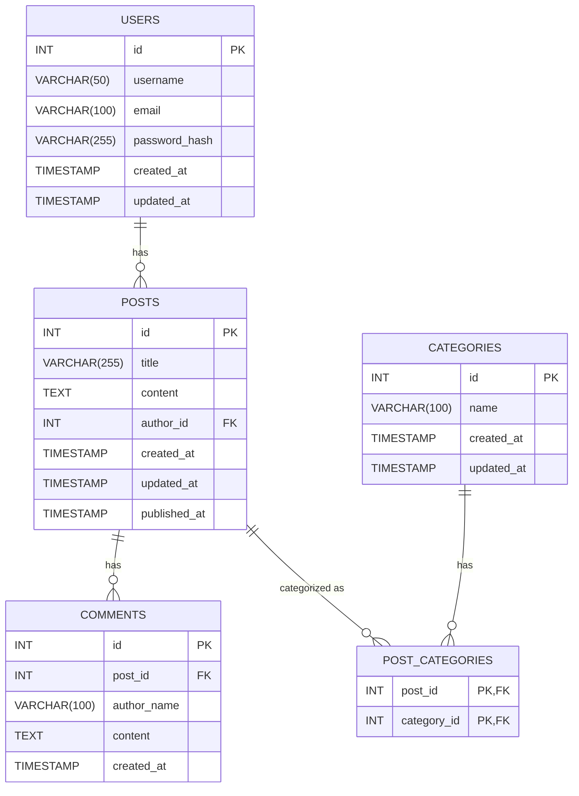
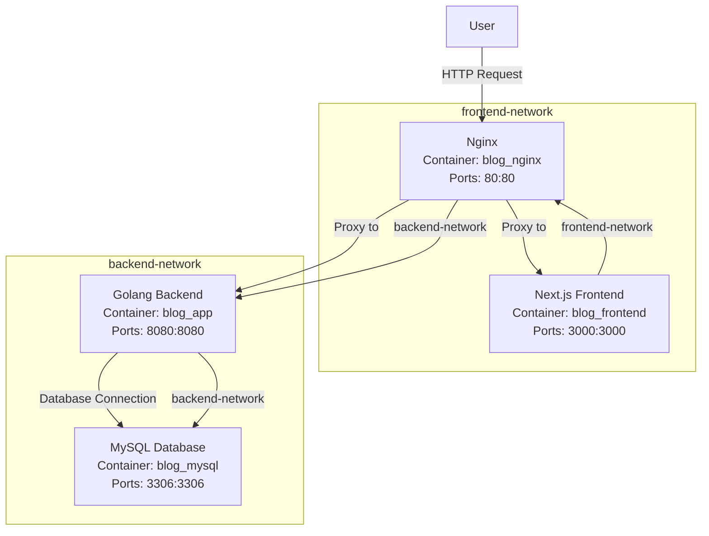
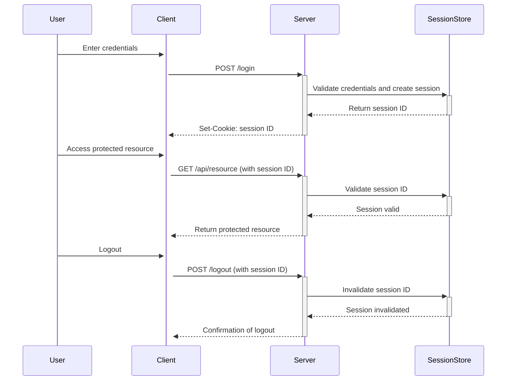

# Makefile タスク一覧

| コマンド         | 説明                                           | 使用方法例                                      |
|------------------|------------------------------------------------|------------------------------------------------|
| `make restart`   | コンテナーの再起動                               | `make restart`                                 |
| `make db-init`   | DBコンテナーの初期化                             | `make db-init`                                 |
| `make app-rebuild` | appコンテナーのビルドと再起動                   | `make app-rebuild`                             |
| `make rebuild`   | 全コンテナーのビルドと再起動                     | `make rebuild`                                 |
| `make logs`      | ログの表示                                     | `make logs`                                    |
| `make stop`      | コンテナーの停止                                 | `make stop`                                    |
| `make clean`     | コンテナーの停止とデータボリュームの削除         | `make clean`                                   |
| `make test`      | 全テストの実行                                 | `make test`                                    |
| `make test-file` | 特定のテストファイルを実行                     | `make test-file FILE=./path/to/your_test.go`   |
| `make test-func` | 特定のテスト関数を実行                         | `make test-func FUNC=TestFunctionName`         |

# Docker

## 再起動

```bash
docker-compose down
docker-compose up -d
```

## appコンテナーの再ビルドと再起動

```
docker-compose build app
docker-compose up -d
```

## Dockerコマンド一覧

| コマンド | 説明 |
|----------|------|
| `docker-compose up -d` | Docker Composeで定義されたサービスをバックグラウンドで起動します。 |
| `docker-compose down` | 起動中のDocker Composeサービスを停止し、コンテナーを削除します。ボリュームは削除しません。 |
| `docker-compose down -v` | 起動中のDocker Composeサービスを停止し、コンテナーとボリュームを削除します。 |
| `docker-compose stop` | 起動中のDocker Composeサービスを停止しますが、コンテナーは削除しません。 |
| `docker-compose start` | 停止中のDocker Composeサービスを再起動します。 |
| `docker-compose restart` | 起動中のDocker Composeサービスを再起動します。 |
| `docker-compose logs` | すべてのサービスのログを表示します。 |
| `docker-compose logs [service_name]` | 指定したサービスのログを表示します。 |
| `docker-compose ps` | 現在のDocker Composeサービスの状態を表示します。 |
| `docker exec -it [container_name] /bin/sh` | 指定したコンテナーにシェルアクセスします。 |
| `docker exec -it [container_name] /bin/bash` | 指定したコンテナーにBashシェルでアクセスします（Bashがインストールされている場合）。 |
| `docker volume ls` | すべてのDockerボリュームをリストします。 |
| `docker volume rm [volume_name]` | 指定したDockerボリュームを削除します。 |
| `docker network ls` | すべてのDockerネットワークをリストします。 |
| `docker network rm [network_name]` | 指定したDockerネットワークを削除します。 |
| `docker images` | すべてのDockerイメージをリストします。 |
| `docker rmi [image_id]` | 指定したDockerイメージを削除します。 |
| `docker system prune` | 使用されていないすべてのコンテナー、ネットワーク、イメージを削除します（ボリュームは削除しません）。 |
| `docker system prune -a` | 使用されていないすべてのコンテナー、ネットワーク、イメージ、およびボリュームを削除します。 |
| `docker-compose build` | Docker Composeで定義されたサービスのイメージをビルドします。 |
| `docker-compose build --no-cache` | キャッシュを使用せずにイメージを再ビルドします。 |
| `docker-compose down && docker-compose up --build -d` | Docker Composeサービスを停止し、イメージを再ビルドしてバックグラウンドで起動します。 |
| `docker-compose down && docker-compose build --no-cache && docker-compose up -d` | Docker Composeサービスを停止し、キャッシュをクリアしてイメージを再ビルドし、バックグラウンドで起動します。 |
| `docker-compose logs -f` | すべてのサービスのログをフォロー（リアルタイムで表示）します。 |
| `docker-compose up --force-recreate -d` | 既存のコンテナーを強制的に再作成して、Docker Composeサービスをバックグラウンドで起動します。 |
| `docker network inspect [network_name]` | 指定したDockerネットワークの詳細情報を表示します。 |
| `docker volume inspect [volume_name]` | 指定したDockerボリュームの詳細情報を表示します。 |
| `docker-compose rm -f` | 停止されたコンテナーを強制的に削除します。 |

## コマンドの使い方の例

1. **Docker Composeサービスの起動**

    ```bash
    docker-compose up -d
    ```

2. **Docker Composeサービスの停止とコンテナーの削除**

    ```bash
    docker-compose down
    ```

3. **Docker Composeサービスの停止とコンテナー、ボリュームの削除**

    ```bash
    docker-compose down -v
    ```

4. **特定のサービスのログを表示**

    ```bash
    docker-compose logs app
    ```

5. **特定のコンテナーにシェルアクセス**

    ```bash
    docker exec -it blog_app /bin/sh
    ```

# curlサンプル一覧（Nginx経由）

| エンドポイント | HTTPメソッド | curlコマンド |
|----------------|--------------|--------------|
| **ユーザー関連** |
| ユーザー登録 | POST | `curl -X POST http://localhost/api/users -H "Content-Type: application/json" -d '{"username": "newuser", "email": "newuser@example.com", "password_hash": "securepassword"}'` |
| ユーザー情報取得 | GET | `curl -X GET http://localhost/api/users/1` |
| **記事関連** |
| 記事作成 | POST | `curl -X POST http://localhost/api/posts -H "Content-Type: application/json" -d '{"title": "New Blog Post", "content": "This is the content of the new blog post.", "author_id": 1}'` |
| 記事一覧取得 | GET | `curl -X GET http://localhost/api/posts` |
| 記事詳細取得 | GET | `curl -X GET http://localhost/api/posts/1` |
| 記事更新 | PUT | `curl -X PUT http://localhost/api/posts/1 -H "Content-Type: application/json" -d '{"title": "Updated Blog Post", "content": "This is the updated content of the blog post."}'` |
| 記事削除 | DELETE | `curl -X DELETE http://localhost/api/posts/1` |
| **カテゴリー関連** |
| カテゴリー作成 | POST | `curl -X POST http://localhost/api/categories -H "Content-Type: application/json" -d '{"name": "New Category"}'` |
| カテゴリー一覧取得 | GET | `curl -X GET http://localhost/api/categories` |
| **コメント関連** |
| コメント作成 | POST | `curl -X POST http://localhost/api/comments -H "Content-Type: application/json" -d '{"post_id": 1, "author_name": "Commenter", "content": "This is a comment."}'` |
| コメント一覧取得 | GET | `curl -X GET http://localhost/api/comments/1` |

# Database

## ER図



## リレーションの詳細

- **USERS と POSTS**
  - `USERS` テーブルの `id` と `POSTS` テーブルの `author_id` によってリレーションが形成されます。
- **POSTS と COMMENTS**
  - `POSTS` テーブルの `id` と `COMMENTS` テーブルの `post_id` によってリレーションが形成されます。
- **POSTS と POST_CATEGORIES**
  - `POSTS` テーブルの `id` と `POST_CATEGORIES` テーブルの `post_id` によってリレーションが形成されます。
- **CATEGORIES と POST_CATEGORIES**
  - `CATEGORIES` テーブルの `id` と `POST_CATEGORIES` テーブルの `category_id` によってリレーションが形成されます。

# ネットワーク図

| ネットワーク名       | コンポーネント       | コンテナー名       | ポート          |
|----------------------|----------------------|------------------|-----------------|
| **frontend-network** | Nginx                | blog_nginx       | 80:80           |
|                      | Next.js Frontend     | blog_frontend    | 3000:3000       |
| **backend-network**  | Golang Backend       | blog_app         | 8080:8080       |
|                      | MySQL Database       | blog_mysql       | 3306:3306       |



# 実装

## 認証

### 1. セッションベース認証

- セッションストアにRedisを使う



#### サンプルリクエスト

1. ログイン
    ```shell
    curl -X POST http://localhost/api/login -c cookie.txt -d '{"email":"test@example.com","password":"password"}' -H "Content-Type: application/json"
    ```
2. セッション情報確認
    ```shell
    curl -X GET http://localhost/api/check-auth -b cookie.txt
    {"authenticated": true}
    ```

### 2. トークンベース認証（JWT - JSON Web Token）

未実装

### 3. OAuth 2.0

未実装